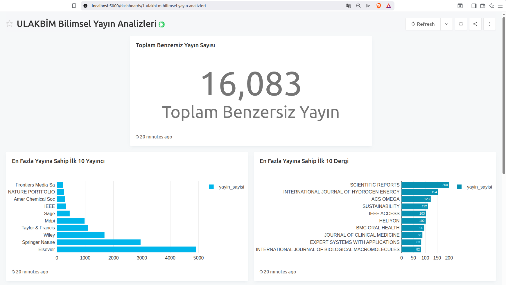
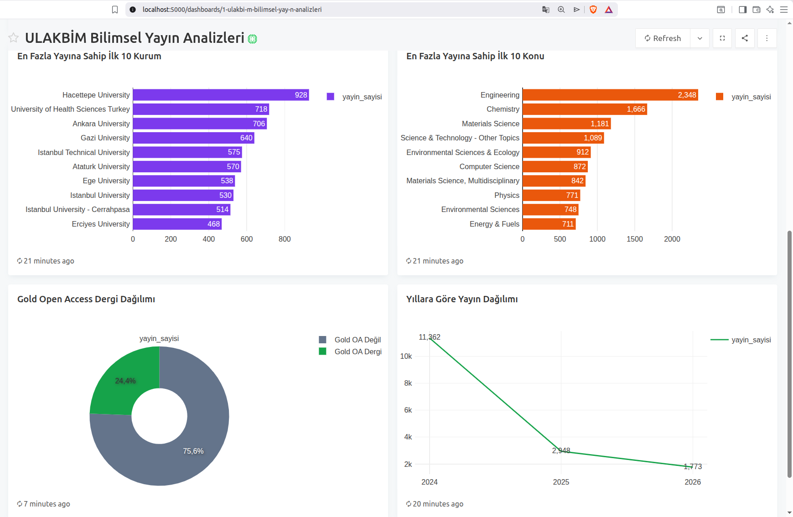
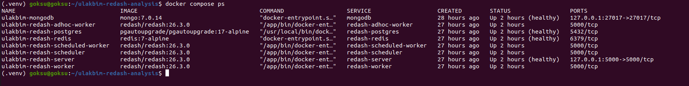

# ULAKBİM Bilimsel Yayın Analizleri

Bu proje, yaklaşık 744 MB büyüklüğündeki ULAKBİM Web of Science JSON veri
setini belleğe bütünüyle almadan okumak, ham kayıtları sade bir yayın modeline
dönüştürmek, MongoDB'ye idempotent olarak aktarmak ve Redash dashboard'unda
analiz etmek için hazırlanmıştır.

Tam veri aktarımı ve dashboard geliştirmesi tamamlanmıştır. Repository; çalışan
Python kodunu, Docker altyapısını, testleri, Redash sorgularını, görselleştirme
ayarlarını ve ekran görüntülerini içerir. Güvenlik ve boyut nedeniyle ham veri,
secret değerleri, canlı MongoDB/Redash volume'ları ve Redash metadata'sı
repository'ye dahil değildir.

## Projenin amacı

- Yaklaşık 744 MB ULAKBİM Web of Science JSON verisini `ijson` ile streaming
  olarak okumak
- Ham kayıtları sade `Publication` domain modeline dönüştürmek
- MongoDB'ye sınırlı batch'ler ve UID tabanlı idempotent upsert ile aktarmak
- MongoDB verisini Redash sorguları, grafikler ve yayımlanabilir bir dashboard
  ile analiz etmek

## Mimari ve veri akışı

```text
Ham JSON
  → ijson streaming reader
  → publication mapper
  → Publication domain modeli
  → import use case
  → MongoDB repository
  → MongoDB
  → Redash sorguları
  → grafikler
  → dashboard
```

Katmanların görevleri:

- `domain`: Altyapıdan bağımsız `Publication` iş modelini içerir.
- `application`: Inspect, mapper doğrulama ve import kullanım senaryolarını
  yönetir; repository sözleşmesine bağımlıdır.
- `infrastructure`: Büyük JSON'u streaming okur, ham kaydı modele dönüştürür,
  `.env` ayarlarını yükler ve MongoDB erişimini gerçekleştirir.
- `src/ulakbim_analysis/main.py`: `inspect`, `validate`, `import` ve `count`
  terminal komutlarını tanımlar; application ve infrastructure katmanlarını
  birbirine bağlar.
- Docker Compose: MongoDB ile Redash/PostgreSQL/Redis servislerini aynı Docker
  ağı üzerinde ve named volume'larla çalıştırır.
- Redash/PostgreSQL/Redis: Redash web arayüzü analizleri sunar; PostgreSQL
  kullanıcı, sorgu ve dashboard metadata'sını kalıcı tutar; Redis sorgu ve görev
  kuyruklarını koordine eder.

Ayrıntılı tasarım kararları için [mimari belgeye](docs/ARCHITECTURE.md) bakın.

```text
src/ulakbim_analysis/
├── application/
├── domain/
├── infrastructure/
└── main.py
tests/
docs/
├── ARCHITECTURE.md
├── images/
└── redash_queries/
```

## Ön koşullar

- Linux veya Docker çalıştırabilen uyumlu bir sistem
- Docker Engine
- Docker Compose eklentisi (`docker compose`)
- Python 3.8 veya proje bağımlılıklarıyla uyumlu daha yeni bir Python sürümü
- Yaklaşık 744 MB ham JSON dosyası
- Docker image'ları, named volume'lar, ham veri ve sanal ortam için yeterli disk
- MongoDB, Redash ve import işlemi için yeterli bellek

Bu projede doğrulanan Python sürümü 3.8'dir. `pyproject.toml` gereksinimi
`Python >=3.8` olarak tanımlıdır.

## Clone sonrası kurulum

### 1. Repository'yi alın

```bash
git clone <repository-url>
cd ulakbim-redash-analysis
```

`<repository-url>` yerine bu repository'nin GitHub clone adresini kullanın.

### 2. Yerel ortam dosyasını hazırlayın

```bash
cp .env.example .env
```

`.env` içindeki yerel geliştirme değerlerini kendi ortamınıza göre düzenleyin.
MongoDB ve Redash/PostgreSQL parolaları ile `REDASH_SECRET_KEY` ve
`REDASH_COOKIE_SECRET` için güçlü, birbirinden farklı değerler kullanın.
`.env` Git tarafından yok sayılır; gerçek secret değerlerini commit etmeyin veya
dokümana eklemeyin.

Compose değişkenleri ve Python uygulamasının `MONGODB_URI` değeri birbiriyle
uyumlu olmalıdır. Host üzerindeki Python uygulaması MongoDB'ye
`127.0.0.1` üzerinden bağlanır.

### 3. Ham veriyi yerleştirin

Ham JSON dosyasını şu tam repository içi konuma koyun:

```text
data/raw/ulakbim_ubyt_wos_records.json
```

Bu dosya `.gitignore` kapsamındadır ve GitHub'a yüklenmez. Reader, üst seviye
JSON array içindeki `item.Data.Records.records.REC.item` kayıtlarını streaming
olarak üretir; dosyanın tamamını belleğe yüklemez veya değiştirmez.

### 4. Python ortamını ve bağımlılıkları kurun

```bash
python3 -m venv .venv
source .venv/bin/activate
python -m pip install --upgrade pip
python -m pip install -e '.[test]'
```

Son komut doğrudan mevcut `pyproject.toml` yapılandırmasına dayanır. Normal
çalışma bağımlılıklarını (`ijson`, `pymongo`, `python-dotenv`) ve `test`
optional dependency grubundaki `pytest` paketini kurar.

### 5. Python testlerini çalıştırın

```bash
PYTEST_DISABLE_PLUGIN_AUTOLOAD=1 python -m pytest
```

ROS veya sistem Python'ına genel olarak kurulmuş ilgisiz pytest eklentileri,
normal `pytest` çağrısına karışıp collection aşamasını bozabilir.
`PYTEST_DISABLE_PLUGIN_AUTOLOAD=1`, yalnız projenin kendi test yapılandırmasıyla
çalışmayı sağlar.

## Docker servisleri

Mevcut [docker-compose.yml](docker-compose.yml) şu servisleri tanımlar:

- `mongodb`: Sadeleştirilmiş yayın belgelerini `mongodb_data` named volume'unda
  saklar.
- `redash-postgres`: Redash kullanıcı, data source, sorgu, görselleştirme ve
  dashboard metadata'sını `redash_postgres_data` named volume'unda saklar.
- `redash-redis`: Redash görev ve sorgu kuyrukları için koordinasyon sağlar;
  kalıcı metadata deposu değildir.
- `redash-server`: `127.0.0.1:5000` üzerinden web arayüzünü sunar.
- `redash-scheduler`: Zamanlanmış Redash görevlerini koordine eder.
- `redash-worker`: Periyodik, e-posta ve varsayılan arka plan işlerini işler.
- `redash-scheduled-worker`: Zamanlanmış sorgu ve schema işlerini işler.
- `redash-adhoc-worker`: Etkileşimli sorguları `queries` kuyruğundan işler.

Doğrulanan image etiketleri `mongo:7.0.14`, `redash/redash:26.3.0`,
`pgautoupgrade/pgautoupgrade:17-alpine` ve `redis:7-alpine` şeklindedir.

### Yeni kurulumda doğrulanmış başlatma sırası

Önce MongoDB, PostgreSQL ve Redis'i başlatın:

```bash
docker compose up -d mongodb redash-postgres redash-redis
docker compose ps
```

Servislerin `healthy` olmasını bekleyin. Ardından yalnızca yeni ve boş bir
Redash PostgreSQL volume'u için metadata şemasını bir kez oluşturun:

```bash
docker compose run --rm redash-server create_db
```

`create_db` yalnız ilk kurulum içindir. Mevcut Redash metadata volume'unda
yeniden çalıştırmayın; sürüm yükseltmelerinde ilgili Redash sürümünün
`manage db upgrade` akışını izleyin.

Bütün servisleri başlatın:

```bash
docker compose up -d
docker compose ps
curl http://localhost:5000/ping
```

Beklenen health yanıtı:

```text
PONG.
```

`.env` içinde `REDASH_PORT` değiştirilirse curl ve tarayıcı adresindeki portu da
aynı şekilde değiştirin.

## Redash ilk yönetici hesabı

Tarayıcıdan şu adresi açın:

```text
http://localhost:5000
```

Yeni kurulum ilk açılışta `/setup` ekranına yönlendirir. Yönetici hesabını bu
ekranda kullanıcı oluşturur. Gerçek parola veya kişisel e-posta bilgisini
repository dosyalarına yazmayın.

## Redash MongoDB data source

Bağlantı adresleri çalıştıkları ağ bağlamına göre farklıdır:

- Host üzerindeki Python uygulaması MongoDB'ye `127.0.0.1` ile bağlanır.
- Redash container'ı MongoDB'ye Docker Compose servis adı `mongodb` ile
  bağlanır.
- Redash formunda `localhost` veya `127.0.0.1` kullanmayın; bunlar Redash
  container'ının kendisini ifade eder.

Redash'te **Settings > Data Sources > New Data Source > MongoDB** yolunu izleyip
alanları şu şekilde doldurun:

| Alan | Değer |
| --- | --- |
| Name | `ULAKBİM MongoDB` |
| Connection String | `mongodb://mongodb:27017/?authSource=admin` |
| Username | `.env` içindeki `MONGODB_ROOT_USERNAME` |
| Password | `.env` içindeki `MONGODB_ROOT_PASSWORD` |
| Database Name | `.env` içindeki `MONGODB_DATABASE` |
| Replica Set Name | Boş |
| Replica Set Read Preference | `Primary Preferred` |
| Flatten Results | `False` |

Secret değerleri README'ye veya sorgu dosyalarına kopyalamayın.

## Ham veri inceleme ve mapper doğrulaması

İlk ham kaydın yapısını görmek ve ilk 1.000 kaydı MongoDB'ye yazmadan mapper
üzerinden doğrulamak için:

```bash
PYTHONPATH=src python -m ulakbim_analysis.main inspect
PYTHONPATH=src python -m ulakbim_analysis.main validate --limit 1000
```

Farklı bir dosya kullanılacaksa `inspect`, `validate` veya `import` komutuna
`--file DOSYA_YOLU` eklenebilir.

## Aşamalı import ve idempotency kontrolü

Önce MongoDB'nin `healthy` olduğundan emin olun. Küçük örneklerle doğrulama
yapmak için:

```bash
PYTHONPATH=src python -m ulakbim_analysis.main import --limit 10 --batch-size 5
PYTHONPATH=src python -m ulakbim_analysis.main import --limit 100 --batch-size 25
PYTHONPATH=src python -m ulakbim_analysis.main import --limit 1000 --batch-size 100
PYTHONPATH=src python -m ulakbim_analysis.main count
```

`count` komutu mevcut CLI'de tanımlıdır ve MongoDB collection'ındaki belge
sayısını gösterir.

Import collection'ı silmez. Repository `uid` alanında unique index oluşturur ve
belgeleri UID üzerinden upsert eder. `UNKNOWN` UID kayıtları atlanır. Aynı
örnek import ikinci kez çalıştırıldığında aynı UID'ler için yeni belge
oluşmaması beklenir. CLI; incelenen, başarıyla dönüştürülen, atlanan, mapping
hatası alan, eşleşen, yeni eklenen ve içeriği değişen belge sayılarını ayrı
gösterir.

Küçük importlar mevcut collection'a yazar. Tam veri setinin zaten yüklü olduğu
bir ortamda bu komutları yeniden çalıştırmaya gerek yoktur.

## Tam import

Yeni ve boş bir kurulumda, küçük doğrulamalar tamamlandıktan sonra tam veri
aktarımı için doğrulanmış komut:

```bash
PYTHONPATH=src python -m ulakbim_analysis.main import --batch-size 500
```

Bu işlem veri boyutuna ve sisteme göre sürebilir. Devamında sayımı doğrulayın:

```bash
PYTHONPATH=src python -m ulakbim_analysis.main count
```

Tamamlanmış aktarımda doğrulanan sonuçlar:

| Kontrol | Sonuç |
| --- | ---: |
| Ham kayıt | 16.101 |
| Başarılı dönüşüm | 16.101 |
| Atlanan kayıt | 0 |
| Dönüşüm hatası | 0 |
| MongoDB benzersiz belge | 16.083 |
| Ham kayıt ile benzersiz belge farkı | 18 |

Ham kayıt sayısının benzersiz belge sayısından 18 fazla olması, yinelenen
UID'lerin unique index ve upsert sayesinde tek MongoDB belgesi olarak
tutulmasıyla uyumludur.

### Veri kalitesi notu

İkinci tam importta yeni kayıt sayısı `0`, toplam MongoDB belge sayısı `16.083`
ve `modified` değeri `2` olarak gözlenmiştir. `2 modified`, iki kopya belge
oluştuğu anlamına gelmez. Bazı yinelenen UID'lerin ham varyasyonları farklı
içeriğe sahip olduğundan, aynı UID sıralı işlendiğinde upsert mevcut belgenin
içeriğini güncelleyebilir. Unique index benzersiz belge sayısını korur.

## Redash sorgularını ve dashboard'u yeniden oluşturma

Redash sorgu JSON'ları ve her görselleştirmenin ayrıntılı ayarları
[Redash sorguları rehberinde](docs/redash_queries/README.md) bulunur.

GitHub clone işlemi Redash'in canlı PostgreSQL metadata'sını otomatik getirmez.
Bu nedenle sorgular, görselleştirmeler ve dashboard yeni Redash ortamında
arayüzden yeniden oluşturulmalıdır:

1. Redash ilk yönetici hesabını oluşturun.
2. `ULAKBİM MongoDB` data source'unu ekleyin.
3. `docs/redash_queries/` altındaki numaralı JSON dosyalarını sırayla Redash
   MongoDB sorgu editörüne yapıştırın.
4. Her sorgu için **Execute** seçeneğini çalıştırın.
5. Query'yi sorgu rehberinde belirtilen adla kaydedin.
6. Görselleştirmeyi belgelenen eksen, etiket, sıralama ve renk ayarlarıyla
   oluşturun.
7. `ULAKBİM Bilimsel Yayın Analizleri` adlı dashboard'u oluşturun.
8. Görselleştirme widget'larını önerilen düzende ekleyin.
9. Dashboard'u **Publish** ile yayımlayın.

Sorguların tamamı `publications` collection'ını kullanır. Redash MongoDB query
runner'ına özgü listeli `$sort` biçimi sorgu rehberinde açıklanmıştır.

## Nihai dashboard sonuçları

Dashboard aşağıdaki analizleri içerir:

- Toplam benzersiz yayın
- İlk 10 yayıncı
- İlk 10 dergi
- İlk 10 kurum
- İlk 10 konu
- Yıllara göre yayın dağılımı
- Gold Open Access dergi dağılımı

Doğrulanmış özet:

| Gösterge | Sonuç |
| --- | ---: |
| Toplam benzersiz yayın | 16.083 |
| 2024 | 11.362 |
| 2025 | 2.948 |
| 2026 | 1.773 |
| Gold OA dergi oranı | yaklaşık %24,4 |
| Gold OA olmayan dergi oranı | yaklaşık %75,6 |

Yıl toplamı 16.083'tür. 2026 verisi veri setinin hazırlandığı tarihe bağlı
olarak kısmi dönemi temsil ediyor olabilir; tam yıllarla karşılaştırırken bu
durum dikkate alınmalıdır.

`institutions` ve `subjects` çok değerli array alanlarıdır. Redash sorguları bu
alanları `$unwind` ile açtığı için bir yayın birden fazla kurum veya konu
kategorisine katkı sağlayabilir. Kurum veya konu kategori toplamlarının
16.083'ü aşması yinelenen yayın olduğu anlamına gelmez.

Gold OA dağılımı genel makale Open Access durumunu değil, ham
`journal_oas_gold` bilgisinden türetilen `journal_gold_open_access` alanındaki
dergi Gold OA durumunu gösterir.

## Ekran görüntüleri

### Dashboard genel görünümü



### Dashboard analizlerinin devamı



### Docker servisleri



## Durdurma, yeniden başlatma ve kalıcılık

Bütün servisleri verileri koruyarak durdurun:

```bash
docker compose stop
```

Aynı named volume'larla tekrar başlatın:

```bash
docker compose up -d
docker compose ps
```

MongoDB verileri `mongodb_data`, Redash metadata'sı
`redash_postgres_data` named volume'unda kalır.

> **Veri kaybı uyarısı:** `docker compose down -v` komutu named volume'ları ve
> dolayısıyla MongoDB yayın verileri ile Redash kullanıcı/sorgu/dashboard
> metadata'sını silebilir. Veriler korunacaksa bu komutu kullanmayın.

## GitHub'a dahil olan ve olmayan bileşenler

GitHub repository'sine dahil olanlar:

- Python kaynak kodu
- `docker-compose.yml`
- `pyproject.toml`
- `.env.example`
- Ana README
- Mimari doküman
- Redash sorgu JSON'ları ve görselleştirme rehberi
- Dashboard ve Docker ekran görüntüleri
- Unit testler

Güvenlik, boyut veya çalışma zamanı durumu nedeniyle dahil olmayanlar:

- `.env` ve gerçek secret değerleri
- Yaklaşık 744 MB ham JSON
- MongoDB `mongodb_data` named volume'u
- Redash PostgreSQL `redash_postgres_data` named volume'u
- Redash yönetici hesabı
- Canlı data source, query, visualization ve dashboard metadata'sı

Repository yeniden kurulabilir; ancak canlı veritabanı ve yayımlanmış dashboard
clone ile doğrudan gelmez. Ham veri import edilmeli ve Redash metadata'sı bu
rehber ile arayüzden yeniden oluşturulmalıdır.

## Testler ve kaynak doğrulama

```bash
python -m compileall src
PYTEST_DISABLE_PLUGIN_AUTOLOAD=1 python -m pytest
```

Unit testler MongoDB, Redash veya büyük ham veri dosyasını gerektirmez.

## Sorun giderme

### Terminalde `(base)` görünüyor

Conda base ortamından çıkıp proje ortamını etkinleştirin:

```bash
conda deactivate
source .venv/bin/activate
```

Base ortamının yeni terminallerde otomatik açılmasını kalıcı olarak kapatmak
isterseniz:

```bash
conda config --set auto_activate_base false
```

### Redash sorgusu 0 satır döndürüyor

Sorgudaki collection adı `publications` olmalıdır. Bu projede
`wos_publications` kullanılmaz. MongoDB data source'un `.env` içindeki doğru
database'e bağlandığını ve import sonrasında `count` komutunun sıfırdan büyük
sonuç verdiğini kontrol edin.

### Redash MongoDB'ye bağlanamıyor

Redash container'ında host `mongodb`, host üzerindeki Python uygulamasında
`127.0.0.1` olmalıdır. Redash data source formunda `localhost` kullanmayın.
Kullanıcı, parola, database ve `authSource=admin` değerlerinin `.env` ile uyumlu
olduğunu kontrol edin.

### `$sort stage must have at least one sort key`

Redash MongoDB query runner'ı standart MongoDB sort nesnesi yerine
[sorgu rehberindeki](docs/redash_queries/README.md) `name` ve `direction`
alanlarına sahip listeli `$sort` biçimini bekler. Repository'deki JSON sorguyu
değiştirmeden kullanın.

### Yatay grafik eksenleri ters

Bar chart ayarlarında Y Column metin kategori (`yayinci`, `dergi`, `kurum` veya
`konu`), X Columns ise sayısal `yayin_sayisi` olmalıdır. Horizontal Chart
ayarını açın.

### Grafik sırası ters veya karışık

Görselleştirmede Sort Values ayarını kapatın; sorgunun sırasını koruyun. En
yüksek değer yanlış taraftaysa Reverse Order ayarını kontrol edin.

### Line chart yalnız tek nokta gösteriyor

MongoDB'ye henüz yalnız bir yılın örnek verisi aktarılmış olabilir. Yeni bir
kurulumda tam import tamamlandıktan sonra sorguyu yeniden çalıştırıp widget'ı
yenileyin.

### Dashboard eski sonucu gösteriyor

Widget üzerindeki yenileme simgesine veya dashboard seviyesindeki **Refresh**
seçeneğine basın.

### Redash açılmıyor

```bash
docker compose ps
docker compose logs redash-server
curl http://localhost:5000/ping
```

PostgreSQL ve Redis health durumlarını, `.env` yapılandırmasını ve
`redash-server` loglarını kontrol edin.

### MongoDB veya Redash verilerinin kaybolmasını önleme

Servisleri `docker compose stop` ile durdurun. Named volume'ları silen
`docker compose down -v` komutunu kullanmayın.
