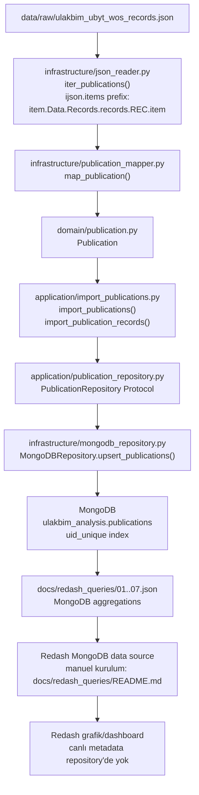
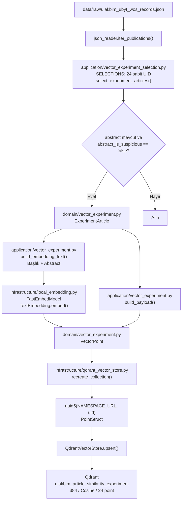
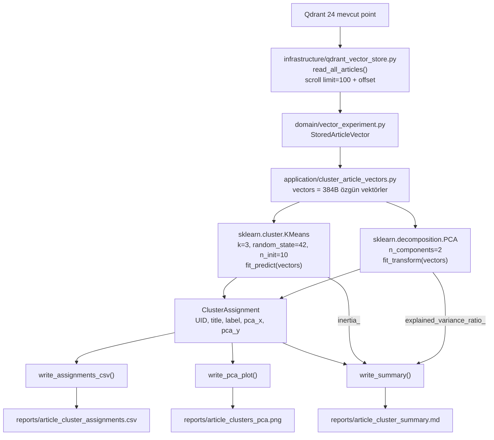
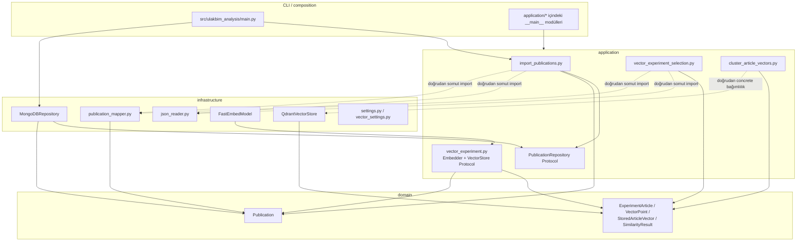

# Proje veri akışları

Bu diyagramlarda yalnız gerçek dosya, sınıf ve fonksiyon adları kullanılmıştır.

## JSON → MongoDB → Redash

**[DOĞRULANDI]** Yazma composition root'u `ulakbim_analysis.main._run_import`;
indexi oluşturur, sonra application use case'ini concrete Mongo adapter ile
çalıştırır (`main.py:121-145`).

## Makale seçimi → embedding → Qdrant

**[DOĞRULANDI]** `load_vector_experiment.main` bu yazma akışını çağırır.
`run_vector_experiment.main` önce aynı load'u, sonra similarity raporunu çağırır.
`recreate_collection` var olan collection'ı siler; bu nedenle audit sırasında bu
iki komut çalıştırılmamıştır.

## Qdrant → KMeans → PCA → raporlar

**[DOĞRULANDI]** PCA kodda KMeans çağrısından önce hesaplanır, fakat KMeans
PCA koordinatlarını değil aynı özgün `vectors` listesini alır. Qdrant clustering
yapmaz.

## Clean architecture katman bağımlılıkları

**[ÇIKARIM]** Domain bağımsız ve bazı use case'ler Protocol kullanıyor; fakat
application'ın somut infrastructure importları nedeniyle yapı tam dependency
inversion uygulayan clean architecture değil, clean-architecture esintili bir
katmanlamadır.
