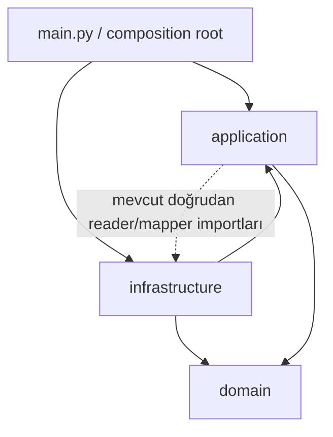

# ULAKBİM Redash Analysis — Proje Çalışma Rehberi

Bu rehber, projeyi ilk kez gören bir bilgisayar mühendisliği öğrencisinin sistemi
kod üzerinden anlayıp teknik olarak anlatabilmesi için hazırlanmıştır. Kaynak
önceliği çalışan kod, Compose tanımı, testler ve sorgu dosyalarıdır. README'deki
çalıştırma geçmişine ait sayılar ayrıca “belgelenmiş doğrulama” olarak
işaretlenmiştir; bu çalışma sırasında tam import veya veritabanı sorgusu
çalıştırılmamıştır.

## 1. Projenin tek paragrafta özeti

Proje, ULAKPaylaş'tan manuel indirilen yaklaşık 744 MB büyüklüğündeki Web of
Science JSON snapshot'ındaki yayınları belleğe bütünüyle almadan okur, karmaşık
ham kayıtları küçük bir `Publication` modeline dönüştürür ve UID anahtarıyla
MongoDB'ye toplu upsert eder. Girdi
`data/raw/ulakbim_ubyt_wos_records.json`, kalıcı iş çıktısı MongoDB
`publications` collection'ındaki sade BSON belgelerdir. MongoDB bilimsel yayın
verisinin asıl analiz deposudur; Redash ise bu veritabanına bağlanıp aggregation
sorgularını çalıştıran, grafik ve dashboard sunan görselleştirme katmanıdır.
Redash'in kendi PostgreSQL'i yayınları değil kullanıcı, sorgu ve dashboard
metadata'sını saklar (`README.md:3-12`, `docker-compose.yml:38-57`,
`src/ulakbim_analysis/main.py:20-22`).

## 2. Veri canlı mı, statik mi?

Veri **statiktir**. Yaklaşık 744 MB JSON dosyası ULAKPaylaş'tan manuel indirilen
bir snapshot'tır (`README.md:3-6`, `README.md:109-119`). Kodda ULAKPaylaş'a
istek atan HTTP istemcisi, canlı API bağlantısı, webhook, Kafka tüketicisi veya
anlık veri akışı yoktur. `pyproject.toml:10-14` içindeki çalışma bağımlılıkları
da yalnız `ijson`, `pymongo` ve `python-dotenv` paketleridir.

Yeni veri geldiğinde dosya yeniden indirilmeli ve `import` komutu yeniden
çalıştırılmalıdır. Redash dosyayı doğrudan okumaz; yalnız MongoDB'ye en son
başarıyla import edilmiş durumu görür. Dolayısıyla “dashboard güncel” demek
“kaynak JSON bugün güncel” demek değildir.

## 3. Uçtan uca veri akışı

1. Ham dosya yolu CLI tarafından belirlenir (`main.py:20-22`, `main.py:71-89`).
2. Reader, `ijson.items` ile kayıtları tek tek üretir (`json_reader.py:7-22`).
3. Her ham `dict`, mapper'a girer (`import_publications.py:104-119`).
4. Mapper temiz bir `Publication` oluşturur (`publication_mapper.py:287-338`).
5. Import use case kayıtları batch'ler (`import_publications.py:94-135`).
6. Repository `UpdateOne` işlemlerini toplu yürütür
   (`mongodb_repository.py:51-73`).
7. Belgeler `publications` collection'ında kalır (`settings.py:8-10`).
8. Redash MongoDB data source bu collection'a erişir
   (`docs/redash_queries/README.md:1-5`).
9. Yedi aggregation sorgusu sonuç üretir; bunlar Counter, bar, line ve
   pie/donut grafiklerine bağlanır (`docs/redash_queries/README.md:31-142`).

```mermaid
flowchart LR
    A[Ham JSON] -->|json_reader.py| B[ijson streaming reader]
    B -->|yield| C[raw publication dict]
    C -->|publication_mapper.py| D[Publication domain modeli]
    D -->|import_publications.py| E[Import use case / batch]
    E -->|mongodb_repository.py| F[MongoDB repository]
    F -->|settings.py: publications| G[(publications collection)]
    G -->|Redash MongoDB data source| H[Aggregation sorguları]
    H --> I[Grafikler]
    I --> J[Dashboard]
```



## 4. Ham JSON yapısı

Asıl kayıt yolu sabit olarak
`item.Data.Records.records.REC.item` tanımlıdır
(`src/ulakbim_analysis/infrastructure/json_reader.py:7`). Buradaki son `item`,
`ijson` söz diziminde array elemanını ifade eder. Her yayın kaydında mapper'ın
kullandığı iki ana dal vardır:

- `static_data`: yayınla birlikte gelen bibliyografik alanlar.
- `static_data.summary`: UID dışındaki başlık, kaynak dergi, yayıncı, yıl,
  doküman türü ve Gold OA kaynağı.
- `static_data.fullrecord_metadata`: kurum/adres, konu, dil ve anahtar kelime.
- `dynamic_data`: inspection komutu tarafından gösterilir, fakat mevcut mapper
  tarafından modele alınmaz (`inspect_dataset.py:47-80`).

Inspection kodunun gerçek gezinmesi:

```python
    static_data = publication.get("static_data", {})

    summary = (
        static_data.get("summary", {})
        if isinstance(static_data, dict)
        else {}
    )

    fullrecord_metadata = (
        static_data.get("fullrecord_metadata", {})
        if isinstance(static_data, dict)
        else {}
    )
```

Kaynak: `src/ulakbim_analysis/application/inspect_dataset.py:47-69`.

`mongoimport` doğrudan tercih edilmemiştir; çünkü ham yapı analiz için gereksiz
alanlar içerir, alanlar bazen tek değer bazen liste olabilir, metinler
temizlenmeli, `Y/N` boolean'a ve yıl integer'a çevrilmeli, kurum tercihi
uygulanmalı ve tekrarlar kaldırılmalıdır. Bunlar mapper'daki gerçek kurallardır
(`publication_mapper.py:6-284`).

## 5. Streaming okuma

Reader'ın tamamı küçüktür:

```python
PUBLICATION_PREFIX = "item.Data.Records.records.REC.item"


def iter_publications(file_path: Path) -> Iterator[Dict[str, Any]]:
    """
    Büyük JSON dosyasındaki yayın kayıtlarını sırayla üretir.

    Dosyanın tamamını belleğe yüklemez. Her seferinde yalnızca
    bir yayın kaydını okuyarak çağıran koda gönderir.
    """
    with file_path.open("rb") as json_file:
        publications = ijson.items(json_file, PUBLICATION_PREFIX)

        for publication in publications:
            if isinstance(publication, dict):
                yield publication
```

Kaynak: `src/ulakbim_analysis/infrastructure/json_reader.py:7-22`.

`ijson`, JSON tokenlarını dosya akışından art arda çözümleyen bir parser'dır.
`json.load` bütün 744 MB metni ve bunun Python nesnelerini aynı anda RAM'e
alırdı; Python nesnelerinin ek yükü nedeniyle kullanım dosya boyutundan da büyük
olabilirdi. Burada `yield`, fonksiyonu generator yapar: çağıran bir sonraki
kaydı istediğinde okuma devam eder. RAM'de dosyanın tamamı değil parser
buffer'ları, güncel kayıt ve import batch'i bulunur. Bellek kullanımı tamamen
sabit denemez; tek kaydın ve `batch_size` kadar modelin boyutuna bağlıdır.

## 6. Domain modeli

```python
@dataclass
class Publication:
    """
    Analiz sisteminde kullanılan sadeleştirilmiş yayın modeli.

    Ham Web of Science JSON yapısını değil, MongoDB ve Redash
    analizlerinde ihtiyaç duyacağımız temiz alanları temsil eder.
    """

    uid: str

    title: Optional[str] = None
    journal: Optional[str] = None
    publisher: Optional[str] = None
    publication_year: Optional[int] = None
    journal_gold_open_access: Optional[bool] = None

    institutions: List[str] = field(default_factory=list)
    subjects: List[str] = field(default_factory=list)
    document_types: List[str] = field(default_factory=list)
    languages: List[str] = field(default_factory=list)
    keywords: List[str] = field(default_factory=list)
```

Kaynak: `src/ulakbim_analysis/domain/publication.py:5-26`.

- `uid`: yayının zorunlu iş kimliği; eksikse mapper geçici olarak `UNKNOWN`
  üretir, use case bunu yazmadan atlar.
- `title`: makale/yayın başlığı (`type=item`).
- `journal`: kaynak dergi başlığı (`type=source`).
- `publisher`: öncelikli temiz yayıncı adı.
- `publication_year`: `int` yayın yılı.
- `journal_gold_open_access`: derginin Gold OA bilgisi; makalenin genel OA
  statüsü değildir.
- Beş liste alanı sırasıyla kurumlar, konular, doküman türleri, diller ve
  anahtar kelimelerdir.

Domain dosyası yalnız `dataclasses` ve `typing` import eder
(`publication.py:1-2`). JSON parser, PyMongo, ortam değişkeni, Docker veya Redash
bilmez. Bu, iş modelinin altyapı değişse de kullanılabilmesini sağlar.

## 7. Mapper derinlemesine incelemesi

Temel normalizasyon yardımcıları:

```python
def as_list(value: Any) -> List[Any]:
    """
    Tek değer veya liste olarak gelebilen alanları
    her zaman liste biçimine dönüştürür.
    """

    if value is None:
        return []

    if isinstance(value, list):
        return value

    return [value]
```

Kaynak: `src/ulakbim_analysis/infrastructure/publication_mapper.py:6-18`.

```python
def clean_text(value: Any) -> Optional[str]:
    """
    Metin değerinin başındaki ve sonundaki boşlukları temizler.

    Boş veya metin olmayan değerlerde None döndürür.
    """

    if not isinstance(value, str):
        return None

    cleaned_value = value.strip()

    if not cleaned_value:
        return None

    return cleaned_value
```

Kaynak: `publication_mapper.py:32-47`.

```python
def unique_texts(values: List[str]) -> List[str]:
    """
    Metin listesindeki tekrarları sıralamayı bozmadan kaldırır.
    """

    unique_values = []
    seen_values = set()

    for value in values:
        if value not in seen_values:
            seen_values.add(value)
            unique_values.append(value)

    return unique_values
```

Kaynak: `publication_mapper.py:50-63`.

Gerçek kurallar ve küçük dönüşüm örnekleri:

| Kural | Ham veri | Temiz veri |
| --- | --- | --- |
| Tek değer/liste | `"Article"` | `["Article"]` |
| Boşluk temizliği | `" Test Article "` | `"Test Article"` |
| Boş metin | `"  "` | `None` |
| Tekrar kaldırma | `["a", "b", "a"]` | `["a", "b"]` |
| Başlık türü | `{"type":"item","content":"Makale"}` | `title="Makale"` |
| Kaynak türü | `{"type":"source","content":"Dergi"}` | `journal="Dergi"` |
| Yayıncı önceliği | unified/full/display birlikte | `unified_name` |
| Kurum tercihi | `pref=N: Bölüm`, `pref=Y: Üniversite` | `["Üniversite"]` |
| Gold OA | `"Y"`, `" n "` | `True`, `False` |
| Eksik çoklu alan | alan yok | `[]` |

Başlık seçimi `type` eşitliğini kontrol edip ilk dolu `content` değerini döndürür
(`publication_mapper.py:66-92`). Yayıncı sırası
`unified_name → full_name → display_name` şeklindedir
(`publication_mapper.py:95-123`). Her adres için `pref="Y"` isimleri varsa
bunlar, yoksa ilk fallback isim alınır (`publication_mapper.py:126-163`).

Gold OA dönüşümünün gerçek kodu:

```python
def parse_gold_open_access(value: Any) -> Optional[bool]:
    """
    journal_oas_gold alanındaki Y/N değerini boolean'a dönüştürür.
    """

    if not isinstance(value, str):
        return None

    normalized_value = value.strip().upper()

    if normalized_value == "Y":
        return True

    if normalized_value == "N":
        return False

    return None
```

Kaynak: `publication_mapper.py:268-284`.

`map_publication`, `static_data`, `summary`, `fullrecord_metadata` ve `pub_info`
dallarını güvenli sözlüklere çevirir; sonra tek `Publication` döndürür
(`publication_mapper.py:287-338`). Eksik skaler alanlar `None`, çoklu alanlar
`[]` olur. Kod `list[str]`, `str | None` gibi Python 3.9/3.10 sözdizimleri yerine
`List[str]` ve `Optional[str]` kullanır; bu, `pyproject.toml:9` ile ilan edilen
Python 3.8 uyumluluğuna uygundur.

## 8. Application katmanı

Use case, kullanıcının amaçladığı iş akışını altyapı ayrıntısından bağımsız
koordine eden fonksiyondur. Buradaki ana use case `import_publications` /
`import_publication_records` ikilisidir.

Repository sözleşmesi küçüktür:

```python
class PublicationRepository(Protocol):
    """Import kullanım senaryosunun ihtiyaç duyduğu küçük depo sözleşmesi."""

    def upsert_publications(
        self,
        publications: List[Publication],
    ) -> RepositoryWriteResult:
        ...
```

Kaynak: `src/ulakbim_analysis/application/publication_repository.py:22-29`.

`Protocol`, somut sınıfın bu sınıftan kalıtım almasını zorunlu kılmadan aynı
metoda sahip olmasını yeterli görür. Use case bu yüzden PyMongo sınıflarını,
`UpdateOne` veya collection ayrıntısını bilmez. Testte `FakeRepository`, gerçek
MongoDB olmadan aynı sözleşmeyi sağlar (`tests/test_import_publications.py:14-42`).

Batch ve hata toleransı:

```python
    for raw_publication in selected_publications:
        result.inspected += 1
        try:
            publication = mapper(raw_publication)
        except Exception as error:
            result.mapping_errors += 1
            if len(result.errors) < max_displayed_errors:
                uid = raw_publication.get("UID", "Bilinmiyor")
                result.errors.append(
                    ImportErrorInfo(
                        uid=str(uid),
                        error_type=type(error).__name__,
                        message=str(error),
                    )
                )
            continue
```

Kaynak: `import_publications.py:104-119`.

`limit` varsa `islice` yalnız istenen sayıda kaydı tüketir
(`import_publications.py:98-102`). Başarılı modeller listeye eklenir; liste
`batch_size` değerine ulaştığında yazılır ve temizlenir, sonda kalan küçük batch
de yazılır (`import_publications.py:121-135`). Tek bir mapper exception'ı
sayılır, en fazla beş ayrıntı saklanır ve `continue` ile sonraki kayda geçilir.
`ImportResult` incelenen, başarılı, atlanan, hatalı, eşleşen, değişen, eklenen,
yazılan ve süre sayaçlarını tutar (`import_publications.py:23-45`).

`validate_mapping` yazma yapmadan ilk `limit` kaydı map eder ve eksik alan
sayılarını raporlar (`validate_mapping.py:9-105`).

## 9. MongoDB repository derinlemesine

`.env`, yalnız `from_env()` çağrısında ve dışarıdan mapping verilmemişse
`load_dotenv()` ile okunur (`settings.py:22-33`). Kod URI'yi parçalardan
**oluşturmaz**; hazır `MONGODB_URI` değerini ortamdan alır. Database, collection
ve timeout ayrı değişkenlerden seçilir; varsayılanlar `ulakbim_analysis`,
`publications`, `5000 ms`'dir (`settings.py:8-20`, `settings.py:35-72`).

Bağlantı ve collection seçimi:

```python
        self._client = client or MongoClient(
            settings.uri,
            serverSelectionTimeoutMS=settings.connect_timeout_ms,
            connectTimeoutMS=settings.connect_timeout_ms,
        )
        self._collection: Collection = self._client[
            settings.database
        ][settings.collection]
```

Kaynak: `src/ulakbim_analysis/infrastructure/mongodb_repository.py:23-30`.

`serverSelectionTimeoutMS` uygun sunucuyu seçmek için, `connectTimeoutMS`
bağlantı kurmak için bekleme sınırıdır. `check_connection` yönetim veritabanına
`ping` yollar (`mongodb_repository.py:32-40`).

Toplu upsert:

```python
        operations = [
            UpdateOne(
                {"uid": publication.uid},
                {"$set": asdict(publication)},
                upsert=True,
            )
            for publication in publications
        ]
        result = self._collection.bulk_write(operations, ordered=False)
        return RepositoryWriteResult(
            matched=result.matched_count,
            modified=result.modified_count,
            upserted=result.upserted_count,
        )
```

Kaynak: `mongodb_repository.py:60-73`.

Upsert, “update veya insert” demektir: UID yoksa belge eklenir; varsa o belgenin
alanları `$set` ile güncellenir. `matched_count` filtresi var olan belgeyle
eşleşen işlem sayısı, `modified_count` gerçekten BSON içeriği değişen belge
sayısı, `upserted_count` yeni eklenen belge sayısıdır. `ordered=False`, bağımsız
işlemlerin sıralı durma zorunluluğunu kaldırır.

`ensure_indexes`, `uid` üzerinde artan, unique ve `uid_unique` adlı index
oluşturur (`mongodb_repository.py:42-49`). `count()` boş filtreyle belge sayar,
`close()` istemci bağlantı havuzunu kapatır (`mongodb_repository.py:75-83`).

## 10. Idempotency ve duplicate UID

README'de kayıt altına alınmış tam import sonuçları şunlardır
(`README.md:292-313`):

| Ölçüm | Değer |
| --- | ---: |
| Ham kayıt | 16.101 |
| Başarılı dönüşüm | 16.101 |
| Dönüşüm hatası | 0 |
| Benzersiz MongoDB belgesi | 16.083 |
| Fark | 18 |
| İkinci tam importta yeni kayıt | 0 |
| İkinci import sonrası toplam | 16.083 |
| İkinci importta `modified` | 2 |

Bu turda tam import ve veritabanı sorgusu özellikle çalıştırılmadığı için bunlar
canlı ortamdan yeniden ölçülen değil, repository'de belgelenmiş sonuçlardır.

Unique index aynı UID ile iki belge oluşmasını veritabanı düzeyinde engeller.
Upsert aynı UID'yi bulup günceller; bu nedenle 16.101 ham kayıt 16.083 benzersiz
kimliğe indirgenebilir. `modified=2`, iki yeni kayıt değildir; yeni kayıt
`upserted` sayacına girer. Olası açıklama, aynı UID'ye sahip ham varyasyonların
alanlarının farklı olması ve bir çalışmada aynı belgeyi sırayla farklı içeriğe
getirmesidir.

Burada iki kavramı ayırmak gerekir:

- **Kayıt sayısı idempotency'si:** Tekrar çalıştırınca belge sayısı artmaz.
- **İçerik determinizmi:** Aynı input sonunda byte/alan düzeyinde aynı nihai
  içeriği üretir.

Mevcut sistem ilkini güçlü biçimde sağlar; belgelenen `modified=2`, duplicate
UID varyasyonları açısından ikincisinin ayrıca ele alınabileceğini gösterir.
Gelecekte aynı UID'nin bütün adayları karşılaştırılıp dolu alan sayısı, liste
zenginliği ve açık bir tie-break kuralıyla “en dolu kayıt kazanır” denebilir.
Bu yaklaşım şu an kodda **yoktur**.

## 11. CLI

Argparse dört alt komut oluşturur:

```python
    subparsers = parser.add_subparsers(dest="command", required=True)

    inspect_parser = subparsers.add_parser(
        "inspect",
        help="Ham verideki ilk yayının yapısını gösterir.",
    )
    inspect_parser.add_argument(
        "--file",
        type=Path,
        default=DEFAULT_DATA_FILE,
    )
```

Kaynak: `src/ulakbim_analysis/main.py:44-54`. `validate` satır 56-69,
`import` satır 71-89 ve `count` satır 91-94'te tanımlıdır.

- `inspect`: ilk ham kaydın temel anahtarlarını gösterir; yazma yapmaz.
- `validate --limit 1000`: ilk 1.000 kaydı map eder, eksikleri sayar; yazmaz.
- `import --limit N --batch-size B`: en fazla N kaydı B'lik batch'lerle
  MongoDB'ye upsert eder. `--limit` verilmezse stream sonuna gider.
- `count`: collection'daki belge sayısını okur.

```bash
PYTHONPATH=src python -m ulakbim_analysis.main inspect
PYTHONPATH=src python -m ulakbim_analysis.main validate --limit 1000
PYTHONPATH=src python -m ulakbim_analysis.main import --limit 10 --batch-size 5
PYTHONPATH=src python -m ulakbim_analysis.main count
```

İlk ikisi salt okunurdur; son ikisi MongoDB bağlantısı ister ve `import` yazma
yapar. Bu çalışma sırasında hiçbirisi çalıştırılmamıştır.

## 12. Clean Architecture değerlendirmesi

Bu proje **Clean Architecture esintili katmanlı mimaridir**, katı/eksiksiz Clean
Architecture uygulaması değildir.



- `domain`: saf `Publication` modeli.
- `application`: import, validation ve inspection kullanım senaryoları.
- `infrastructure`: ijson reader, mapper, settings, PyMongo repository.
- `main.py`: CLI ve somut bağımlılıkların bağlandığı composition root.

Repository yönünde bağımlılık ters çevrilmiştir: application bir `Protocol`
tanımlar, infrastructure onu yapısal olarak gerçekleştirir
(`publication_repository.py:22-29`, `mongodb_repository.py:15-83`).
Ancak `application/import_publications.py:19-20` doğrudan infrastructure reader
ve mapper'ı, validation/inspection dosyaları da infrastructure'ı import eder.
Katı Clean Architecture'da iç application halkası dış infrastructure halkasını
bilmezdi; iterator ve mapper fonksiyonu dışarıdan enjekte edilebilirdi.

Bu küçük projede her ayrıntı için factory, interface ve adapter eklenmemesi KISS
yaklaşımıdır. Ayrıştırma, test edilebilirliği sağlayacak kritik sınırda
(repository) yapılmış; gereksiz soyutlama eklenmemiştir. Dosyaların çoğu tek
sorumluluğa sahiptir.

## 13. Docker Compose derinlemesine

Tüm servisler Compose'un otomatik oluşturduğu aynı varsayılan network'tedir;
birbirlerini servis adıyla çözer. Yalnız MongoDB ve Redash web portu host'a
açılır.

| Servis | Image / komut | Görev | Bağımlılık | Port | Healthcheck | Volume / env |
| --- | --- | --- | --- | --- | --- | --- |
| `mongodb` | `mongo:7.0.14` | Yayın belgeleri | Yok | `${MONGODB_HOST}:${MONGODB_PORT}:27017` | `mongosh ... ping` | `mongodb_data:/data/db`; root user/password/database |
| `redash-postgres` | `pgautoupgrade/pgautoupgrade:17-alpine` | Redash metadata | Yok | Host'a açık değil | `pg_isready` | `redash_postgres_data`; PG user/password/db |
| `redash-redis` | `redis:7-alpine` | Kuyruk/koordinasyon | Yok | Host'a açık değil | `redis-cli ping` | Kalıcı volume yok; env yok |
| `redash-server` | `redash/redash:26.3.0`, `server` | Web/API | healthy PG+Redis | `127.0.0.1:${REDASH_PORT}:5000` | HTTP `/ping` | ortak Redash env |
| `redash-scheduler` | aynı, `scheduler` | Zamanlama | healthy server | Yok | Kendi healthcheck'i yok | ortak env |
| `redash-worker` | aynı, `worker` | periodic,email,default | healthy server | Yok | Yok | `QUEUES`, `WORKERS_COUNT=1` |
| `redash-scheduled-worker` | aynı, `worker` | scheduled_queries,schemas | healthy server | Yok | Yok | `WORKERS_COUNT=1` |
| `redash-adhoc-worker` | aynı, `worker` | interaktif queries | healthy server | Yok | Yok | `WORKERS_COUNT=2` |

Kanıt: `docker-compose.yml:1-13` ortak Redash image/env,
`docker-compose.yml:15-36` MongoDB, `38-68` PostgreSQL/Redis, `70-136` Redash
rolleri ve `138-140` named volume'lardır. `depends_on` yalnız belirtilen
başlangıç/sağlık sırasını sağlar; MongoDB Redash servislerinin Compose
bağımlılığı olarak yazılmamıştır, fakat aynı network üzerinden erişilebilir.
Secret değerler bu rehbere alınmamıştır; yalnız değişken adları gösterilmiştir.

## 14. Docker neden kullanıldı?

Hocanın Docker'ı zorunlu tuttuğuna dair repository'de kanıt yoktur; Docker bir
teknik tercihtir. Docker olmadan MongoDB, PostgreSQL, Redis ve Redash host'a ayrı
ayrı kurulup servis yöneticisiyle çalıştırılabilir, Python ise sanal ortamda
çalıştırılabilirdi.

Avantajları image sürümlerini sabitleme, bağımlılıkları izole etme, kurulumu
tekrar edilebilir kılma, servis adlarını DNS olarak kullanma, named volume ile
kalıcılık ve host portlarını açıkça yönetmedir. Dezavantajları sekiz servis,
image/volume için disk, RAM/CPU kullanımı, ağ ve Compose öğrenme maliyeti,
log/upgrade yönetimi ve production güvenliği için ek iştir.

## 15. Host ve container hostname farkı

Host'ta çalışan Python, host'a yayınlanan MongoDB portunu kullanır:
`127.0.0.1:27017`. Redash container'ı ise Compose network'ündeki servis adını
kullanır: `mongodb:27017` (`README.md:213-237`,
`docker-compose.yml:23-24`).

Container içindeki `localhost`, host'u ya da MongoDB container'ını değil o
container'ın kendisini gösterir. Bu yüzden Redash formuna
`mongodb://mongodb:27017/?authSource=admin` yazılır; `localhost` yazılırsa
Redash kendi container'ında MongoDB arar.

## 16. Named volume ve veri kalıcılığı

- `mongodb_data`, MongoDB `/data/db` dizisini saklar.
- `redash_postgres_data`, PostgreSQL `/var/lib/postgresql/data` dizisini saklar
  (`docker-compose.yml:25-26`, `46-47`, `138-140`).

Container çalışan süreç ve yazılabilir geçici katmandır; volume yaşam döngüsü
container'dan ayrılmış veri alanıdır. `docker compose stop` container'ları
durdurur, volume'ları korur. `docker compose up -d` aynı proje ve volume
adlarıyla veriyi yeniden bağlar. `docker compose down -v` ise named volume'ları
silerek yayınları ve Redash metadata'sını geri döndürülemez biçimde
kaybettirebilir (`README.md:389-409`). Bu komut bu çalışmada kullanılmamıştır.

## 17. Redash mimarisi

Redash veritabanı değildir; veri kaynaklarını sorgulayan analiz uygulamasıdır.
MongoDB bilimsel yayın belgelerini, PostgreSQL Redash kullanıcı/data
source/query/visualization/dashboard metadata'sını tutar. Redis görev ve sorgu
kuyruğudur. Server web arayüzü ve API'yi sunar; worker'lar sorgu ve arka plan
işlerini çalıştırır; scheduler zamanlanmış görevleri kuyruğa yönlendirir
(`docker-compose.yml:38-136`, `README.md:145-162`).

## 18. Redash–MongoDB bağlantısı

README'deki form, Compose servis adı ve MongoDB ayarlarıyla uyumludur:

| Form alanı | Değer/kural |
| --- | --- |
| Name | `ULAKBİM MongoDB` |
| Connection String | `mongodb://mongodb:27017/?authSource=admin` |
| Username/password | Yerel `.env` değerleri; dokümana kopyalanmaz |
| Database Name | `MONGODB_DATABASE` |
| Replica Set | Boş |
| Read Preference | Primary Preferred |
| Flatten Results | False |

Kaynak: `README.md:223-237`; Compose MongoDB servis adı
`docker-compose.yml:15`, kullanıcı değişkenleri `19-22`'dedir. `authSource=admin`
root kullanıcının doğrulandığı veritabanını belirtir. Mevcut kurulum root
kimliklerini kullanıyor görünmektedir; production'da yalnız okuma yetkili,
uygulama veritabanına sınırlandırılmış Redash kullanıcısı daha güvenlidir.

## 19. Redash MongoDB sorguları

Yedi dosyanın tamamı `publications` collection'ını kullanır.

1. **Toplam yayın:** yalnız `$count: "toplam_yayin"`; tek sayıyı Counter olarak
   göstermek en doğrudan seçimdir
   (`01_total_unique_publications.json:1-8`).
2. **İlk 10 yayıncı:** boşları `$match` ile çıkarır, yayıncıya `$group` eder,
   sayıyı azalan `$sort`, `$limit:10`, yatay grafiğe uygun artan tekrar sıralama
   ve `$project` uygular. Uzun kategori adları için yatay bar uygundur
   (`02_top_10_publishers.json:1-46`).
3. **İlk 10 dergi:** yayıncı pipeline'ının `journal` karşılığıdır; yatay bar
   kategori karşılaştırmasını kolaylaştırır
   (`03_top_10_journals.json:1-46`).
4. **İlk 10 kurum:** önce `$unwind` ile her kurum array elemanını ayrı pipeline
   satırına açar; sonra match/group/sort/limit/sort/project uygular
   (`04_top_10_institutions.json:1-49`).
5. **İlk 10 konu:** aynı işlemi `subjects` için yapar
   (`05_top_10_subjects.json:1-49`).
6. **Yıllar:** null yılları `$match` ile çıkarır, yıla `$group` eder, kronolojik
   sıralar ve alanları `$project` eder. Zaman eğilimi için line chart seçilmiştir
   (`06_publications_by_year.json:1-35`).
7. **Gold OA:** boolean/null değerlerine `$group` eder, iç içe `$cond` ile
   Türkçe etiket verir, sayıya göre sıralar. Bütünün paylarını göstermek için
   pie/donut uygundur (`07_gold_oa_journal_distribution.json:1-50`).

`$match` filtre, `$group` toplulaştırma, `$sort` sıralama, `$limit` satır
sınırı, `$project` çıktı alanı/yeniden adlandırma, `$unwind` array açma ve
`$count` tüm belge sayımıdır. Kurum ve konu sorgularında bir yayın birden çok
array elemanına sahip olabildiğinden kategori toplamları 16.083'ü aşabilir; bu
duplicate yayın kanıtı değildir.

Redash MongoDB query runner'ı bu projede standart
`{"$sort":{"alan":-1}}` yerine
`{"$sort":[{"name":"alan","direction":-1}]}` biçimini bekler
(`docs/redash_queries/README.md:7-22`). Bu Redash'e özel temsil repository'deki
yedi JSON'da doğrulanmıştır.

## 20. Nihai MongoDB dashboard bulguları

README ve dashboard belgelerinde kaydedilen nihai değerler:

- Toplam benzersiz yayın: **16.083**
- 2024: **11.362**
- 2025: **2.948**
- 2026: **1.773**
- Gold OA dergi: yaklaşık **%24,4**
- Gold OA değil: yaklaşık **%75,6**

Kaynak: `README.md:339-373`. Yıl toplamı 16.083'tür. 2026 snapshot'ın alındığı
tarihe göre kısmi dönem olabilir; 2024/2025 ile tam yıl gibi karşılaştırılmamalı.
Gold OA, genel makale erişimi değil dergi niteliğidir. Görsel kanıtlar:
[`docs/images/dashboard-overview.png`](images/dashboard-overview.png) ve
[`docs/images/dashboard-analyses.png`](images/dashboard-analyses.png).
Bu turda dashboard veya MongoDB yeniden sorgulanmamıştır.

## 21. Redash avantaj ve sınırlamaları

Projeye uygun avantajlar: native MongoDB query runner, ayrıca MySQL/SQL data
source desteği, self-hosted ve açık kaynak dağıtım, kayıtlı sorgular, çoklu veri
kaynağı, dashboard, Counter/bar/line/pie görselleri ve refresh olanağıdır.

Sınırlamalar: canlı dashboard metadata'sı Git'teki JSON dosyalarıyla gelmez;
PostgreSQL ve Redis gibi ek servisler ister; ilk hesap/data source/query/widget
kurulumu UI'da manueldir; export/provisioning otomasyonu yoksa clone sonrası
dashboard yeniden yapılır; MongoDB `$sort` gibi runner'a özgü biçimler vardır;
kaynak tüketimi yüksektir. Production için HTTPS, secret yönetimi, erişim
kontrolü, yedekleme ve güvenlik sıkılaştırması gerekir.

## 22. MySQL ek görevi: kanıt sınırı ve doğru tasarım

Bu repository'de TR Dizin–GROBID projesinin kodu, MySQL Compose servisi, şeması,
örnek SQL'i, data source export'u veya external network tanımı yoktur. `README`,
`docs`, kaynak ağacı ve Compose içinde `MySQL`, `articles`,
`processing_runs`, `comparison_matches` veya ilgili JOIN kanıtı bulunmamıştır.
Bu nedenle “bağlandı”, “şu sonucu verdi” ya da gerçek tablo kolonları hakkında
iddia kurulamaz. Aşağıdaki bölüm, kullanıcı tarafından belirtilen önceki proje
bağlamına göre **önerilen/öğretici tasarımdır**, bu repository'nin uygulanmış
özelliği değildir.

TR Dizin–GROBID verisi ilişkisel tablolar ve tablolar arası bağlar içeriyorsa
MySQL seçimi doğaldır: `articles` ile `processing_runs` bir anahtar üzerinden
`JOIN` edilebilir; `comparison_matches` eşleşme türüne göre gruplanabilir.
`GROUP BY` kategori bazında sayım, `AVG` ortalama referans veya süre, `MIN/MAX`
sınırlar, `UNION ALL` farklı ama kolonları uyumlu sonuç kümelerini birleştirmek
için kullanılabilir. Bunların gerçek kolon ve anahtarları önceki repository
incelenmeden yazılmamalıdır.

Ayrı dashboard, MongoDB yayın keşfi ile GROBID işleme/karşılaştırma metriklerini
anlamsal olarak ayırır. Redash çoklu data source sunar, ancak tek bir normal
query içinde iki ayrı kaynağı otomatik JOIN etmekle veritabanı içi JOIN aynı şey
değildir. Olası kartlar ortalama referans karşılaştırması, işleme süresi ve
eşleşme türü dağılımıdır; gerçek SQL ancak şema doğrulandıktan sonra yazılmalıdır.

MySQL başka Compose projesindeyse Redash container'ı ortak bir Docker network'e
katılmalıdır. `docker network connect` ile yapılan manuel bağlantı container
yeniden oluşturulunca kaybolabilir. Kalıcı çözüm, iki Compose dosyasında aynı
`external: true` network'ü tanımlamak ve servisleri Compose seviyesinde bu ağa
bağlamaktır. Hostname MySQL servis adı, port container içi `3306` olur; kullanıcı
tercihen read-only olmalıdır.

## 23. Test stratejisi

Doğrulamada **39 test case** toplanmıştır. Dosyalardaki test fonksiyonu sayısı
daha az görünür; `pytest.mark.parametrize` her veri satırını ayrı case yapar.

- `tests/conftest.py:6-65`: gerçek ham şekle benzeyen küçük
  `raw_publication` fixture'ı.
- `tests/test_publication_mapper.py:22-158`: liste/metin/tekrar
  normalizasyonu, title, publisher, kurum tercihi, konu/tür/dil/keyword,
  yıl/Gold OA ve uçtan uca mapping.
- `tests/test_import_publications.py:14-181`: MongoDB gerektirmeyen
  `FakeRepository`, batch sınırları, limitin fazla kayıt tüketmemesi, geçersiz
  seçenek, UNKNOWN UID, kayıt bazlı hata toleransı, ikinci import ve modified.
- `tests/test_cli.py:8-21`: dört komutun parser'da olması ve pozitif sayı
  doğrulaması.
- `tests/test_settings.py:6-35`: environment mapping, zorunlu URI ve timeout.

744 MB gerçek dosya unit testte kullanılmaz; testler hızlı, deterministik ve
taşınabilir olmalıdır. Reader'ın gerçek büyük dosyayla streaming davranışı unit
test kapsamından ziyade entegrasyon doğrulamasıdır. Normal testler MongoDB
istemez, çünkü import use case fake repository ile sınanır.

Komut:

```bash
PYTEST_DISABLE_PLUGIN_AUTOLOAD=1 python -m pytest
```

Sistem Python'ına kurulmuş ROS pytest eklentileri collection'a karışabildiği
için plugin autoload kapatılır (`README.md:134-143`). Bu turda proje venv'i
Python 3.8.10 ve pytest 8.3.5 ile `39 passed` üretmiştir.

## 24. Yapılan doğrulamalar

İki tür kanıt ayrılmalıdır:

**Bu incelemede yeniden çalıştırılanlar**

- `.venv/bin/python -m compileall src`: başarılı; syntax/import-bytecode
  derleme kontrolü.
- `PYTEST_DISABLE_PLUGIN_AUTOLOAD=1 .venv/bin/python -m pytest`: 39 passed.
- Yedi dosya için `python -m json.tool`: tüm query JSON'ları parse edildi.
- Git durumu başlangıçta temizdi.
- Dosya ağacı, Compose, `.env.example`, `.gitignore`, kod, test ve docs okundu.
- Doküman sonrası Markdown yerel link, secret örüntüsü ve kod referansı
  kontrolleri yapılmıştır.

**README'de belgelenen, bu turda yeniden çalıştırılmayanlar**

- İlk 1.000 gerçek kayıtta 0 mapping hatası.
- 10/100/1000 aşamalı import, tam import ve ikinci import.
- MongoDB `uid_unique` index, BSON veri tipleri ve toplam belge sayısı.
- Docker healthcheck'leri, Redash `/ping`, volume persistence.
- Redash sorgularının canlı sonuçları ve dashboard değerleri.

README'de açık “BSON veri tipi kontrolü” veya “Markdown link/secret leak kontrol
komutu” kaydı yoktur; kod BSON'a uygun `int/bool/list/None` üretir ve bu rehberde
ayrı statik kontroller uygulanmıştır. Bu ayrım, yapılmamış canlı kontrolü yapılmış
gibi göstermemek için önemlidir.

## 25. GitHub ve yeniden kurulabilirlik

Git'e dahil olanlar kaynak kod, Compose, `pyproject.toml`, README,
`.env.example`, testler, mimari doküman, yedi sorgu, sorgu rehberi ve ekran
görüntüleridir. Dahil olmayanlar `.env`, 744 MB JSON, MongoDB volume'u, Redash
PostgreSQL volume'u, canlı kullanıcı hesabı ve canlı dashboard metadata'sıdır
(`.gitignore:1-17`, `README.md:411-436`).

Clone sonrası dashboard gelmez; çünkü widget ve kullanıcı durumu PostgreSQL
volume'undadır, Git'teki JSON'lar yalnız sorgu tarifleridir. Yeniden kurulum:
`.env.example` temelinde yerel secret'ları oluştur, ham dosyayı yerleştir,
bağımlılıkları kur/test et, Compose veri servislerini başlat, yeni Redash
metadata şemasını bir kez oluştur, yayınları import et, Redash hesabı ve MongoDB
data source'u ekle, yedi JSON'u çalıştır/kaydet, görselleri oluştur, dashboard'a
ekle ve yayımla (`README.md:82-199`, `315-337`).

## 26. Hocaya sunum akışı (5–10 dakika)

1. **Problem:** “744 MB'lık karmaşık bir bilimsel yayın snapshot'ını RAM'e
   bütünüyle almadan analiz edilebilir hale getiriyorum.”
2. **Ham veri:** “Kayıtlar `item.Data.Records.records.REC.item` yolunda;
   bibliyografik alanlar `static_data` altında.”
3. **Streaming:** “`ijson` ve generator sayesinde bir defada tek kayıt
   çözümleniyor.”
4. **Mapping:** “Değişken JSON şekillerini tek modelde normalize ediyor,
   boşlukları ve tekrarları temizliyorum.”
5. **MongoDB:** “Array alanlı yayın belgeleri MongoDB'nin belge modeline doğal
   uyuyor.”
6. **Upsert/idempotency:** “UID unique index ve upsert ikinci çalışmada kopya
   belge oluşmasını engelliyor.”
7. **Docker:** “MongoDB ve Redash'in PostgreSQL/Redis/worker bileşenleri sabit
   image'larla aynı ağda kuruluyor.”
8. **Redash:** “Redash veriyi tutmuyor; MongoDB aggregation sonuçlarını
   görselleştiriyor.”
9. **Dashboard:** “16.083 benzersiz yayın; yıllar ve Gold OA dağılımları dahil
   yedi analiz var.”
10. **MySQL ek kabiliyeti:** “Redash ikinci bir ilişkisel kaynağı da
    gösterebilir; ancak bu repository'de önceki MySQL projesinin bağlantı kanıtı
    yok, onu ayrı doğrulamak gerekir.”
11. **Testler:** “Fake repository ile MongoDB'siz 39 case; mapper, import, CLI
    ve settings davranışları doğrulanıyor.”
12. **Veri kalitesi:** “16.101 ham kayıt 18 yinelenen UID nedeniyle 16.083
    belge; ikinci importtaki 2 modified yeni kayıt değildir.”

## 27. Muhtemel mentor soruları ve cevapları

1. **Veri canlı mı?** Hayır; manuel indirilen yaklaşık 744 MB snapshot.
2. **Neden MongoDB?** Kaydın iç içe ve çok değerli alanları belge/array olarak
   doğal saklanıyor; aggregation ile analiz ediliyor.
3. **Neden Redash?** MongoDB data source, kayıtlı sorgu, grafik ve dashboard'u
   self-hosted sunuyor.
4. **Neden Metabase/Superset değil?** Repository'de karşılaştırmalı seçim
   belgesi yok. Redash seçiminin doğrulanabilir nedeni mevcut Compose ve native
   MongoDB sorgularıdır; diğer araçların “uygunsuz” olduğu iddia edilemez.
5. **Neden Docker?** Sekiz servis ve sürümlerini izole, tekrarlanabilir ve ortak
   ağda çalıştırmak için.
6. **Docker zorunlu muydu?** Zorunlu olduğuna dair kanıt yok; teknik tercih.
7. **Volume nedir?** Container'dan bağımsız kalıcı veri alanı.
8. **Redis neden var?** Redash sorgu ve arka plan görev kuyruklarını koordine
   eder.
9. **PostgreSQL neden var?** Redash kullanıcı, query, visualization ve dashboard
   metadata'sını saklar.
10. **MongoDB ve Redash aynı veriyi mi tutuyor?** Hayır; MongoDB yayınları,
    Redash/PostgreSQL analiz metadata'sını tutar.
11. **`json.load` neden kullanılmadı?** Tüm dosya ve Python nesnelerini RAM'e
    alacağı için.
12. **`ijson` nedir?** JSON'u akış halinde tokenlayıp seçilen yoldaki öğeleri
    sırayla üreten parser.
13. **Mapper nedir?** Ham, değişken şekilli kaydı temiz domain modeline çeviren
    kod.
14. **Domain modeli nedir?** Analizin ihtiyaç duyduğu teknoloji bağımsız iş
    nesnesi `Publication`.
15. **Repository nedir?** Kalıcı depoya erişimi use case'e küçük bir sözleşmeyle
    sunan bileşen.
16. **Protocol neden var?** Application'ın PyMongo yerine davranış sözleşmesine
    bağlanması ve fake ile test edilmesi için.
17. **Upsert nedir?** Eşleşme varsa update, yoksa insert.
18. **Idempotent nedir?** Aynı işlemi tekrar etmenin belge sayısını
    değiştirmemesi.
19. **Unique index nedir?** Aynı `uid` değerinin iki belgede bulunmasını
    engelleyen veritabanı kuralı/indexi.
20. **16.101 neden 16.083 oldu?** Belgelenen sonuçta 18 fazla ham kayıt,
    yinelenen UID'lerle uyumlu; upsert tek belge tutar.
21. **2 modified ne demek?** İki var olan belgenin içeriği değişmiş; iki yeni
    belge eklenmiş demek değil.
22. **Kurum toplamı neden yayın toplamından fazla?** `$unwind` ile bir yayının
    her kurumu ayrı katkı verir.
23. **Gold OA alanı neyi ifade ediyor?** Kaynak derginin Gold Open Access
    niteliğini; makalenin tüm OA statüsünü değil.
24. **Hoca clone edince neden dashboard gelmez?** Canlı dashboard metadata'sı
    Git'te değil PostgreSQL volume'unda.
25. **Production'a çıkmak için ne eksik?** HTTPS/reverse proxy, güçlü secret
    yönetimi, read-only kullanıcı, yedekleme, monitoring, log rotation ve erişim
    politikaları.
26. **MySQL Redash'e nasıl bağlandı?** Bu repository bağlantının yapıldığını
    doğrulamıyor. Genel olarak ortak Docker network, MySQL servis hostname'i ve
    read-only data source hesabı gerekir.
27. **Hostname neden localhost değil?** Container'da localhost container'ın
    kendisidir; diğer servis Compose DNS adıyla bulunur.
28. **`docker compose down -v` neden tehlikeli?** MongoDB ve PostgreSQL named
    volume'larını silebilir.
29. **Testler neyi garanti ediyor?** Test edilen mapper/import/CLI/settings
    davranışlarını; canlı MongoDB, Docker veya dashboard'un her ortamda
    çalışmasını garanti etmez.
30. **Bu gerçekten Clean Architecture mı?** Esintili katmanlı yapı; application
    infrastructure import ettiği için katı Clean Architecture değil.
31. **Batch neden var?** Her kayıt için ayrı ağ çağrısını azaltıp belleği sınırlı
    tutmak için.
32. **`ordered=False` ne sağlar?** Bulk işlemlerin sıkı sıraya bağlı olmadan
    yürütülmesini; tek hata davranışı yine PyMongo/MongoDB sonucuna bağlıdır.
33. **Eksik UID ne olur?** Mapper `UNKNOWN` üretir, use case yazmadan atlar.
34. **Redash veriyi dönüştürüyor mu?** Kalıcı ETL yapmıyor; MongoDB aggregation
    pipeline'ını çalıştırıp sonucu görselleştiriyor.
35. **2026 neden düşük?** Snapshot 2026'nın kısmi döneminde alınmış olabilir;
    bu bir olasılık uyarısıdır.

## 28. Terimler sözlüğü

1. **JSON:** Nesne, array ve temel değerlerle veri taşıyan metin biçimi.
2. **Streaming:** Veriyi tamamını beklemeden küçük parçalar halinde işleme.
3. **Iterator:** Bir sonraki öğeyi sırayla veren nesne.
4. **Generator:** `yield` ile tembel biçimde değer üreten iterator fonksiyonu.
5. **Mapper:** Bir veri şeklini başka bir modele dönüştüren bileşen.
6. **Normalization:** Değişken girdileri tutarlı biçim ve tipe getirme.
7. **Domain:** Problemin teknoloji bağımsız iş kavramları.
8. **Use case:** Kullanıcı amacını gerçekleştiren uygulama iş akışı.
9. **Repository:** Kalıcı veri erişimini soyutlayan sınır.
10. **Protocol:** Python'da gerekli metotların yapısal tip sözleşmesi.
11. **Dependency:** Bir modülün çalışmak için ihtiyaç duyduğu başka bileşen.
12. **Infrastructure:** Dosya, veritabanı ve ortam gibi dış dünya adaptörleri.
13. **CLI:** Komut satırı arayüzü.
14. **Batch:** Birlikte işlenen sınırlı kayıt grubu.
15. **Upsert:** Eşleşeni güncelle, yoksa ekle işlemi.
16. **Unique index:** Bir alan değerinin benzersizliğini zorlayan index.
17. **Idempotency:** Tekrar çalıştırmanın gözlenen sonucu çoğaltmaması.
18. **BSON:** MongoDB'nin JSON benzeri ikili belge biçimi.
19. **Collection:** MongoDB'de belge grubu; ilişkisel tablodan farklıdır.
20. **Document:** MongoDB'deki alan/değerlerden oluşan tek kayıt.
21. **Aggregation:** Belgeleri filtreleyip gruplama ve hesaplama işlemi.
22. **Pipeline:** Çıktısı sonraki adıma giren sıralı aşamalar.
23. **`$unwind`:** Array'in her elemanını ayrı pipeline belgesine açar.
24. **`$group`:** Anahtara göre kayıtları gruplar ve toplam üretir.
25. **`$match`:** Koşula uyan belgeleri geçirir.
26. **`$project`:** Çıktı alanlarını seçer, hesaplar veya yeniden adlandırır.
27. **`$sort`:** Sonuçları alana göre sıralar.
28. **`$limit`:** En fazla kaç sonuç kalacağını belirler.
29. **`$count`:** Pipeline'daki belgeleri sayar.
30. **Docker:** Uygulamaları image'lardan izole süreçler olarak çalıştırır.
31. **Container:** Image'ın çalışan örneği.
32. **Image:** Container için salt okunur paketlenmiş dosya/çalışma ortamı.
33. **Volume:** Container yaşam döngüsünden bağımsız veri depolama alanı.
34. **Network:** Container'ların birbirine ad ve portla eriştiği sanal ağ.
35. **Port:** Bir ağ servisinin dinlediği numaralı uç.
36. **Healthcheck:** Servisin hazır/sağlıklı olup olmadığını sınayan komut.
37. **Compose:** Çok container'lı sistemi YAML ile tanımlayan Docker aracı.
38. **Redis:** Redash'in kuyruk/koordinasyon için kullandığı bellek içi depo.
39. **PostgreSQL:** Redash metadata'sını saklayan ilişkisel veritabanı.
40. **Redash:** Veri kaynaklarını sorgulayıp görselleştiren BI uygulaması.
41. **Worker:** Kuyruktan arka plan veya sorgu işi çalıştıran süreç.
42. **Scheduler:** Zamanlanmış işleri uygun zamanda kuyruğa koyan süreç.
43. **Dashboard:** Birden çok görsel ve sayacı tek ekranda birleştiren görünüm.
44. **Data source:** Redash'in bağlandığı veritabanı bağlantı tanımı.
45. **SQL JOIN:** İlişkili anahtarlara göre iki tablo satırlarını birleştirme.
46. **Environment variable:** Ayarı kod dışında sürece veren isim/değer.
47. **Secret:** Parola veya anahtar gibi açıklanmaması gereken değer.
48. **Snapshot:** Belirli bir andaki veri setinin sabit kopyası.

## 29. Sistemin güçlü ve zayıf yönleri

**Güçlü yönler:** 744 MB girdi için streaming; sade domain modeli; hızlı ve
MongoDB'siz 39 test; UID unique index ve bulk upsert; sorgular ve yeniden kurulum
için dokümantasyon; MongoDB yanında ikinci data source'a açık Redash mimarisi;
sabit image'lar ve named volume'larla tekrar kurulabilirlik.

**Zayıf/geliştirilebilir yönler:** Duplicate UID varyasyonlarında belgelenen
`modified=2` nedeniyle içerik determinismi politikası eksik; canlı veri çekme
yok; Redash metadata otomatik export/provision edilmiyor; MySQL ortak network
entegrasyonu bu repository'de tanımlı değil ve manuel ise kalıcı olmayabilir;
production HTTPS yok; Redash için root yerine read-only MongoDB hesabı daha iyi
olur; monitoring, alert ve log rotation tanımlı değil; veri büyürse sorgu
alanlarında index/explain analizi gerekir; otomatik dashboard provisioning
yoktur. Application'ın infrastructure importları da katı katman yönünü bozar.

## 30. Sunumdan 10 dakika önce oku

### Amaç

744 MB statik Web of Science JSON snapshot'ını RAM'e bütünüyle almadan temiz
yayın belgelerine çevirip MongoDB/Redash ile analiz etmek.

### Mimari ve veri akışı

`JSON → ijson/yield → mapper → Publication → import batch → PyMongo upsert →
MongoDB publications → Redash aggregation → grafik → dashboard`

Domain iş modelidir; application akışı yönetir; infrastructure dosya/veritabanı
ayrıntılarıdır; `main.py` bunları bağlar. Yapı clean-inspired'dır, katı Clean
değildir.

### Ana teknolojiler

Python 3.8+, ijson, dataclass, typing Protocol, PyMongo, MongoDB 7, Docker
Compose, Redash 26.3, PostgreSQL 17 ve Redis 7.

### Nihai sayılar

16.101 ham kayıt → 16.083 benzersiz belge; fark 18; mapping hatası 0. İkinci tam
import: yeni 0, toplam 16.083, modified 2. Yıllar: 2024=11.362,
2025=2.948, 2026=1.773. Gold OA dergi yaklaşık %24,4; değil %75,6. Bunlar
README'de belgelenmiştir; 2026 kısmi olabilir.

### 10 kritik kavram

1. Streaming: tüm dosyayı RAM'e almama.
2. Generator: `yield` ile kayıt üretme.
3. Mapper: ham şekli temiz modele çevirme.
4. Domain: teknoloji bağımsız `Publication`.
5. Repository Protocol: PyMongo'dan bağımsız sözleşme.
6. Batch: sınırlı grup halinde bulk yazma.
7. Upsert: varsa güncelle, yoksa ekle.
8. Unique index: duplicate UID'yi engelleme.
9. Idempotency: tekrar importta sayının artmaması.
10. `$unwind`: bir yayının çoklu kurum/konularını ayrı katkıya açma.

### 10 kritik mentor cevabı

1. Veri canlı değil, manuel snapshot.
2. MongoDB yayın verisini; PostgreSQL yalnız Redash metadata'sını tutar.
3. Redis Redash kuyruğudur.
4. Redash veritabanı değil analiz/görselleştirme aracıdır.
5. Docker zorunluluğu kanıtlı değil, teknik tercihtir.
6. Host Python `127.0.0.1`, container Redash `mongodb` hostname'ini kullanır.
7. 16.101–16.083 farkı yinelenen UID'lerle uyumludur.
8. `modified=2` yeni iki kayıt demek değildir.
9. Clone sonrası dashboard gelmez; metadata volume'da, Git'te değil.
10. Testler kod davranışını doğrular; canlı veritabanı/dashboard'u garanti
    etmez.

---

## Kaynak güvenilirliği ve README/kod karşılaştırması

İnceleme sonunda bulunan nüanslar:

1. README genel akışı kodla uyumludur; reader yolu, model, CLI komutları,
   collection adı, upsert/index ve Compose servisleri doğrulanmıştır.
2. README'nin “application repository sözleşmesine bağımlıdır” özeti eksik
   nüanslıdır: import, validate ve inspect application modülleri doğrudan
   infrastructure reader/mapper import eder (`import_publications.py:19-20`,
   `validate_mapping.py:5-6`, `inspect_dataset.py:4`).
3. README'deki 16.101/16.083, ikinci import, canlı healthcheck ve dashboard
   değerleri kaynak koddan türetilemez; bunlar belgelenmiş operasyonel
   sonuçlardır ve bu turda veritabanına dokunmadan yeniden ölçülmemiştir.
4. README'de MySQL/TR Dizin–GROBID entegrasyonu yoktur; bu repository'den
   uygulanmış bağlantı veya SQL ayrıntısı doğrulanamaz.
5. Ayar kodu MongoDB URI'sini bileşenlerden kurmaz; hazır `MONGODB_URI` okur
   (`settings.py:35-40`). URI'nin bileşenlerden uyumlu hazırlanması
   `.env.example`/kullanıcı sorumluluğudur.
6. Compose'da scheduler ve worker servislerinin kendilerine ait healthcheck'i
   yoktur; server'ın healthy olmasına bağımlıdırlar
   (`docker-compose.yml:94-136`).
7. README Python 3.8'in doğrulandığını söyler; bu incelemedeki venv gerçekten
   Python 3.8.10'dur. Kabukta çıplak `python` komutu yoktur; doğrulama
   `.venv/bin/python` ile yapılmıştır.
